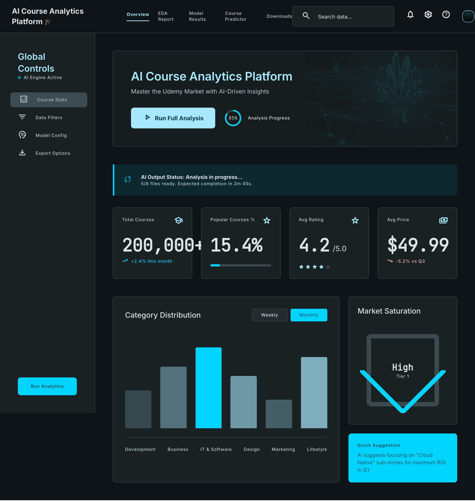
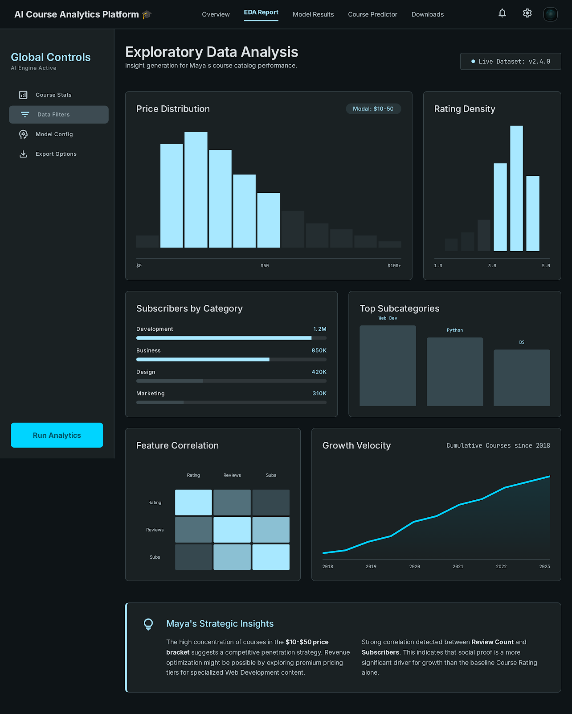
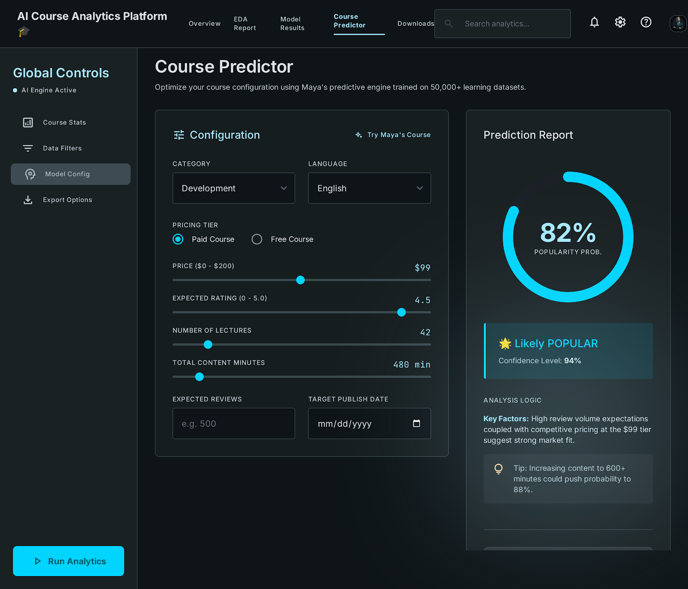
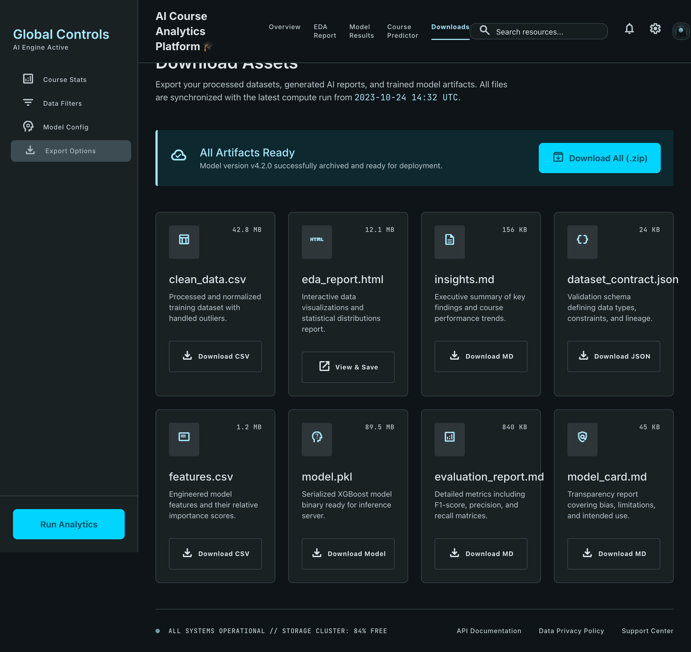
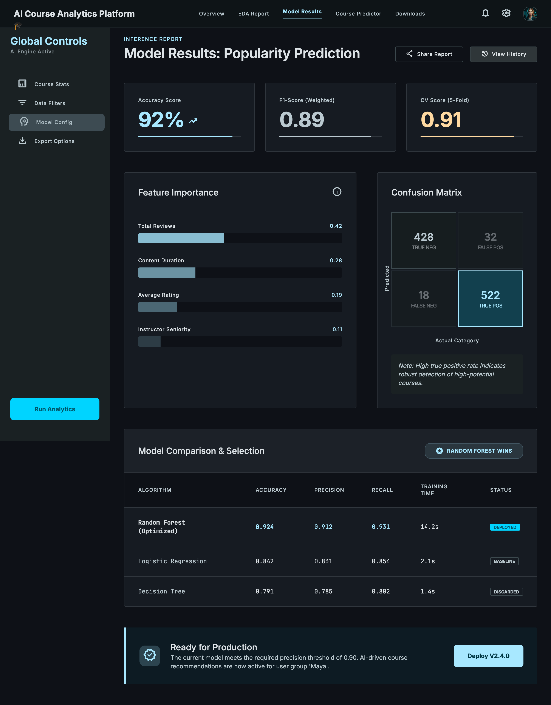
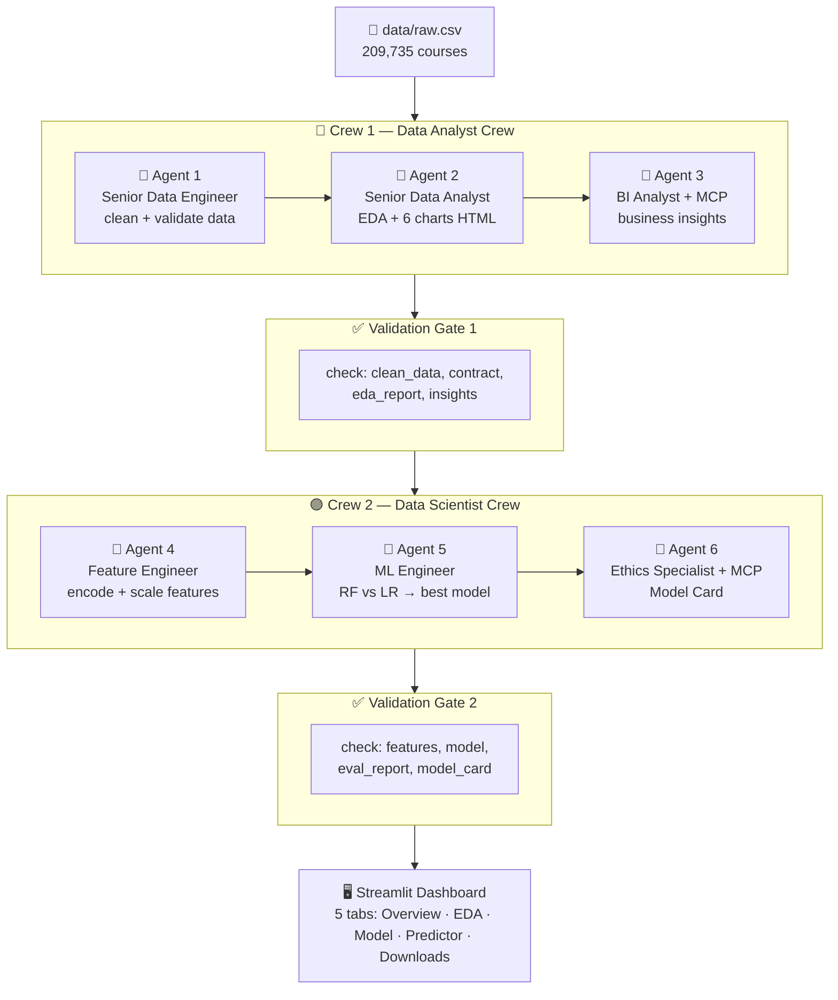

# 🎓 AI Course Analytics Platform

> Automated analysis of 200,000+ Udemy courses using **CrewAI Flow**, **scikit-learn**, and **Streamlit**.  
> Predicts course popularity and delivers actionable insights for course creators.

[](tests/)
[](tests/)
[](https://python.org)
[](https://crewai.com)
[](https://streamlit.io)
[](https://share.streamlit.io)

---

## 🎨 UX Prototype (Google Stitch)

Designed with [Google Stitch](https://stitch.withgoogle.com) — AI-powered UI prototyping tool.  
Design system: dark theme, Primary Cyan `#00D4FF`, Inter typography — see [`docs/ux-prototype/DESIGN.md`](docs/ux-prototype/DESIGN.md).

| Overview | EDA Report |
|----------|-----------|
|  |  |

| Course Predictor | Downloads |
|-----------------|-----------|
|  |  |

| Model Results |  |
|--------------|--|
|  | |

---

## 🏗️ Architecture



---

## ⚡ Quick Start

```bash
# 1. Clone and activate
git clone https://github.com/ofrywaits/ai-course-analytics.git
cd ai-course-analytics
python -m venv venv && source venv/bin/activate
pip install -r requirements.txt

# 2. Set your Groq API key
echo "GROQ_API_KEY=your_key_here" > .env

# 3. Run the full AI pipeline
python main.py

# 4. Launch the dashboard
streamlit run app.py
```

> 🔑 Get a free Groq API key at [console.groq.com](https://console.groq.com)

---

## 📁 Output Files

| File | Description | Generated By |
|------|-------------|-------------|
| `clean_data.csv` | 206,885 cleaned courses | Crew 1 — Data Engineer |
| `dataset_contract.json` | Schema & row-count contract | Crew 1 — Data Engineer |
| `eda_report.html` | EDA report with 6 embedded charts | Crew 1 — Data Analyst |
| `insights.md` | Business insights & recommendations | Crew 1 — BI Analyst |
| `features.csv` | Encoded & scaled ML features | Crew 2 — Feature Engineer |
| `model.pkl` | Random Forest classifier (87.4% accuracy) | Crew 2 — ML Engineer |
| `evaluation_report.md` | Accuracy, CV score, confusion matrix | Crew 2 — ML Engineer |
| `model_card.md` | Google-standard Model Card | Crew 2 — Ethics Specialist |

---

## 🧪 Tests

```bash
python -m pytest tests/ -v
# 50 passed in ~15s
```

| Test File | Coverage |
|-----------|---------|
| `test_data_tools.py` | Data pipeline: target, time features, outliers, missing values |
| `test_model_tools.py` | ML pipeline: feature engineering, training, model persistence |
| `test_validators.py` | Validation: file existence, Crew 1 & 2 gate checks |
| `test_monitoring.py` | Health checks, run metrics parsing |
| `test_mcp_tools.py` | MCP graceful fallback |

---

## 🛠️ Tech Stack

| Layer | Technology | Why this choice |
|-------|-----------|----------------|
| AI Orchestration | **CrewAI Flow** | Native `@start/@listen` flow control, sequential crews with validation gates |
| LLM | **Groq llama-3.3-70b-versatile** | Free tier, fast inference, avoids OpenAI cost |
| ML | **scikit-learn (RF + LR)** | Interpretable, no GPU needed, feature importances for dashboard |
| MCP | **@modelcontextprotocol/server-filesystem** | Agents read output files directly — grounded responses |
| Dashboard | **Streamlit** | Zero front-end code, fast iteration, built-in file downloads |
| Visualisation | **Plotly** (interactive) + **Matplotlib/Seaborn** (HTML report) | Best tool per context |
| Deployment | **Railway** | Zero-config, auto-deploy on push to main |

---

## 🏛️ Architecture Decisions

### Why 2 Crews instead of 1?
Separation of concerns — Crew 1 produces *data artefacts* (CSV, HTML, Markdown).  
Crew 2 consumes those artefacts to produce *ML artefacts* (pkl, evaluation).  
The validation gate between them enforces a strict contract: Crew 2 never runs on bad data.

### Why Sequential process instead of Parallel?
Each task depends on the previous task's output (e.g. EDA needs clean data, ML needs features).  
Parallel would require complex dependency management with no real throughput gain here.

### Why Groq instead of OpenAI?
Free tier (12,000 TPM on llama-3.3-70b-versatile) is sufficient because all heavy computation  
(pandas, sklearn) happens in Python — the LLM only writes narrative summaries (< 300 words each).

### Why LabelEncoder instead of OneHotEncoder?
The Random Forest model handles ordinal-style integer encoding well, and OneHotEncoding  
would create 130+ columns for subcategory alone — increasing noise without improving accuracy.

### Why MCP on Agents 3 and 6 only?
Agents 1/2 write files; Agents 3/6 *read* those files to produce insights/model cards.  
MCP filesystem access is only meaningful for consumers, not producers.

---

## 📂 Project Structure

```
retail-analytics-crewai/
├── main.py                   # Entry point — setup logging, kickoff Flow
├── flow.py                   # CrewAI Flow: @start/@listen, validation gates
├── app.py                    # Streamlit dashboard (5 tabs)
├── monitoring.py             # Health checks, run metrics, system info
├── config.py                 # All constants and paths — single source of truth
├── PROJECT.md                # Problem, User, MVP, UX flow, UI decisions
├── DEPLOYMENT.md             # Railway deployment guide
├── CHANGELOG.md              # Version history and decision log
├── Procfile                  # Railway start command
├── railway.json              # Railway build & deploy config
├── pytest.ini                # Test discovery and log settings
├── data/
│   └── raw.csv               # Udemy dataset (209K courses)
├── crews/
│   ├── analyst_crew/         # Crew 1: agents, tasks, crew runner
│   └── scientist_crew/       # Crew 2: agents, tasks, crew runner
├── tools/
│   ├── data_tools.py         # 7-step data cleaning pipeline
│   ├── viz_tools.py          # 6 chart functions → base64 HTML
│   ├── model_tools.py        # RF + LR training, evaluation, persistence
│   └── mcp_tools.py          # MCP filesystem server adapter
├── validation/
│   └── validators.py         # ValidationError + Crew 1 & 2 gate checks
├── tests/                    # 50 unit tests (pytest)
└── outputs/                  # All 8 generated artefacts
```

---

## 👤 User Story

> *"As an independent course creator, I want to analyse 200,000+ Udemy courses  
> so that I can make data-driven decisions about pricing, category, and launch timing  
> before I publish my next course."*

See [PROJECT.md](PROJECT.md) for the full problem definition, user persona, and MVP spec.
